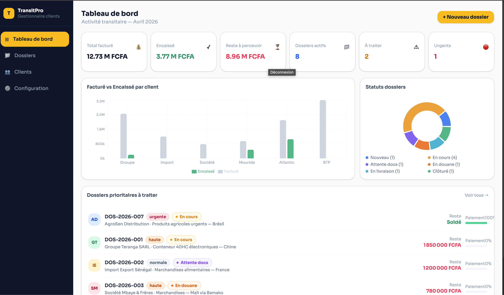
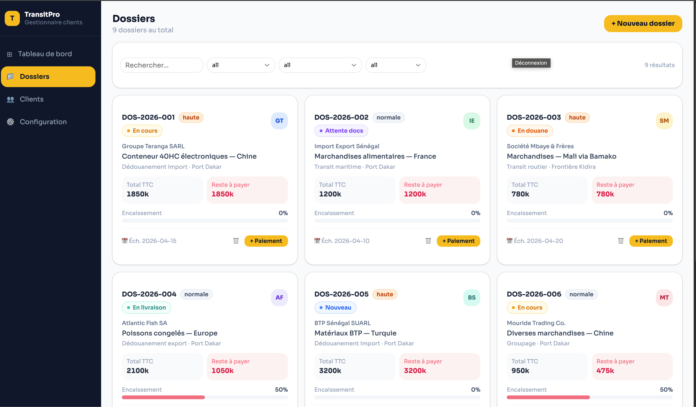
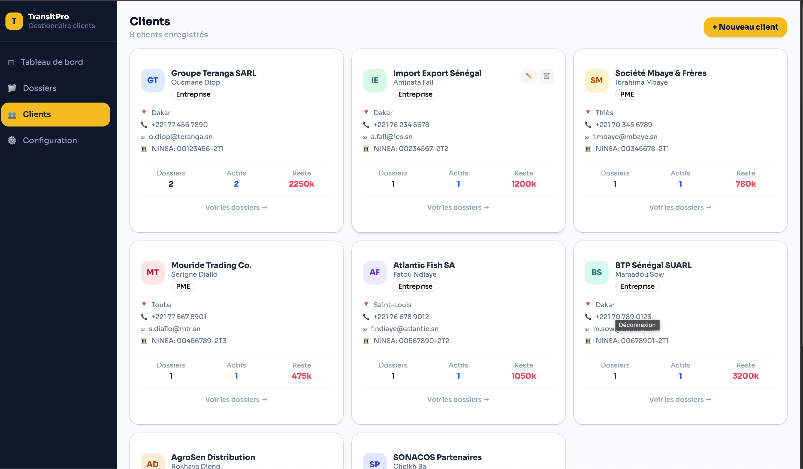

# 🚀 TransitPro

<p align="center">
  
</p>

<p align="center">
  <b>Solution moderne de gestion de transit et logistique</b><br/>
  Centralisez vos opérations, automatisez vos flux et pilotez votre activité en temps réel.
</p>

---

## 🏷️ Badges

<p align="center">


</p>

---

## ✨ Aperçu

<p align="center">
  
  
</p>
<p align="center">
  
  
</p>
---

## ✨ Fonctionnalités

### 📦 Gestion métier
- Gestion complète des **dossiers de transit**
- Suivi des clients, agents et opérations
- Historique des activités

### 💰 Finance
- Encaissements / Décaissements
- Calcul automatique des charges
- Suivi mensuel et annuel
- Reporting financier

### 📊 Analytics
- Dashboard en temps réel
- Statistiques avancées
- Indicateurs de performance

### 🧾 Documents
- Export PDF professionnel
- Factures et rapports
- Format A4 optimisé impression
- Header / Footer personnalisés

### ⚡ Performance
- Lazy loading
- Virtual scroll
- Optimisation SSR / CSR

---

## 🧠 Stack Technique

- **Frontend** : Next.js, React, Tailwind CSS
- **UI** : Shadcn UI
- **Backend** : Next.js API Routes
- **PDF Engine** : jsPDF / Puppeteer
- **State** : Zustand / Context API

---

## 🏗️ Architecture


---

## ⚙️ Installation

```bash
git clone https://github.com/ton-repo/transitpro.git

cd transitpro

npm install

npm run dev